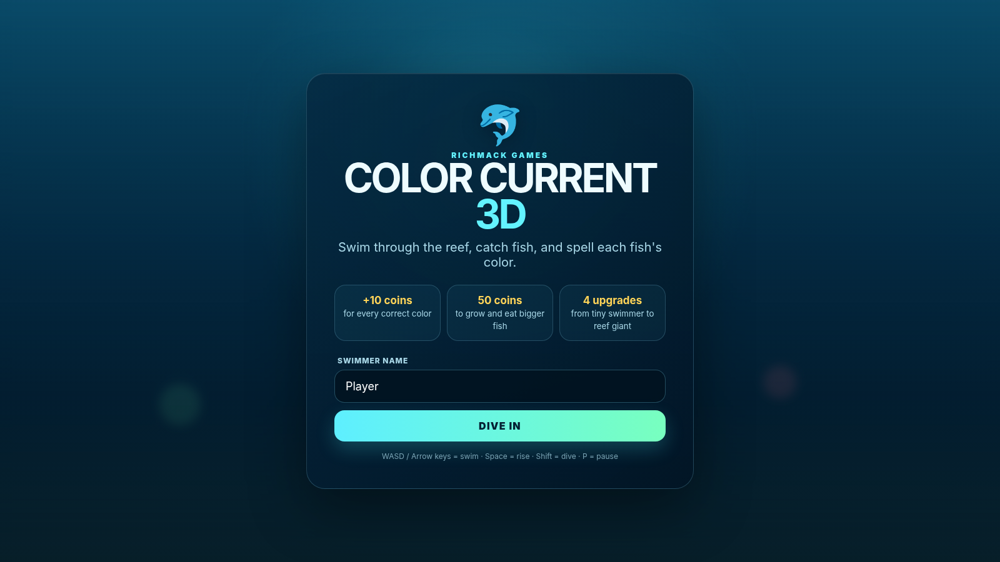
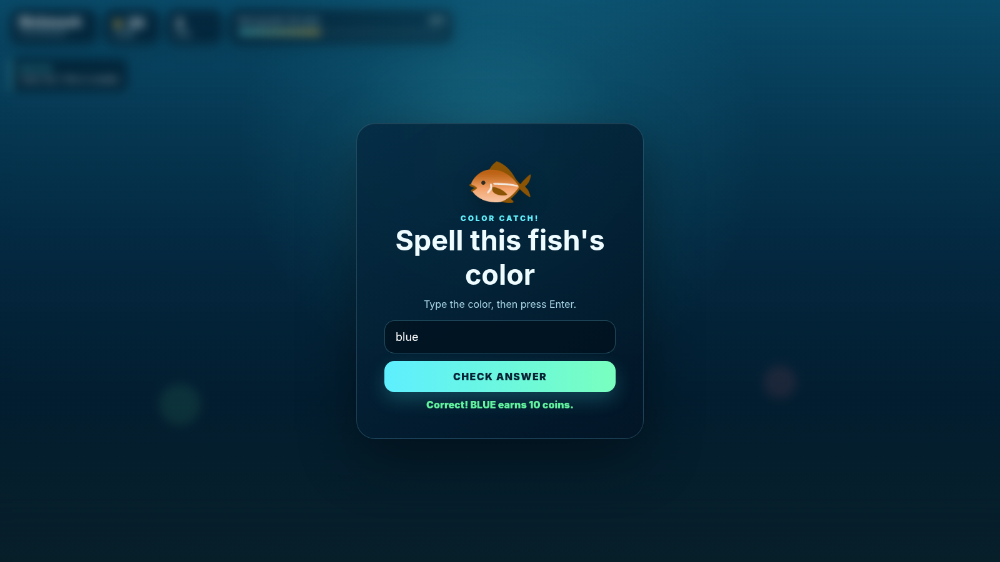
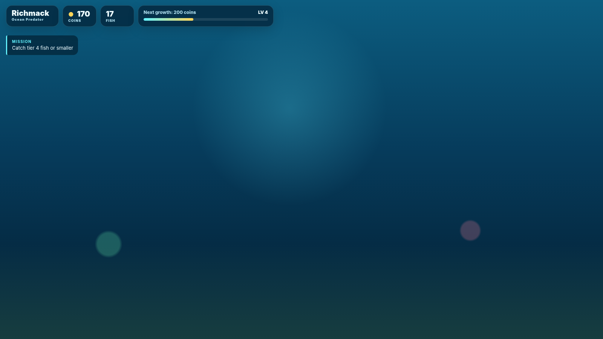
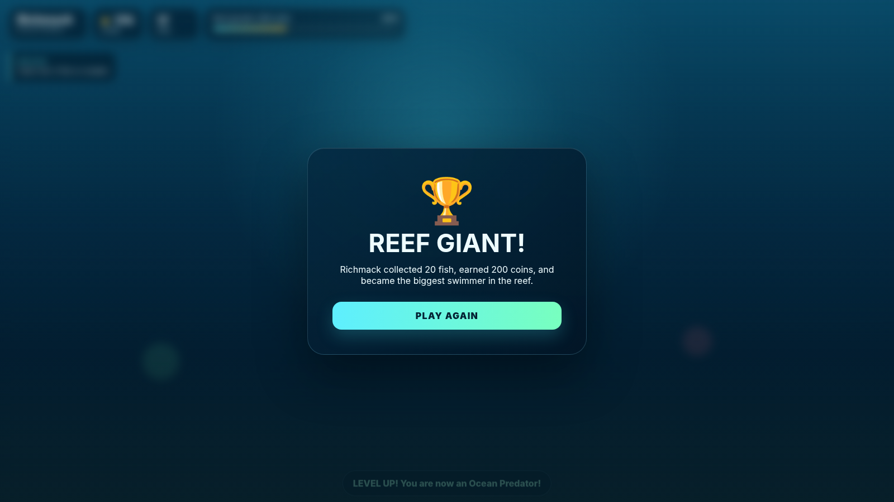

# Color Current 3D

[](https://github.com/iamrichmack111/color-current-3d/actions/workflows/ci-cd.yml)


**Color Current 3D** is a browser-based Three.js underwater spelling game. Swim through a reef, catch fish your swimmer is large enough to eat, spell each fish's color, earn coins, and grow from a Tiny Swimmer into the Reef Giant.

## Gameplay

- **Catch fish:** swim into fish at or below your current size tier.
- **Spell colors:** each catch opens a color-spelling challenge.
- **Earn coins:** every correct answer awards 10 coins.
- **Grow:** every 50 coins unlocks the next swimmer size.
- **Win:** reach 200 coins and become the **Reef Giant**.
- **Explore:** a foggy 3D reef includes coral, plants, rocks, ruins, bubbles, and schools of fish.
- **Desktop + touch:** keyboard controls are supported, with touch controls on smaller devices.

## Controls

| Action | Control |
| --- | --- |
| Swim forward | `W` / `↑` |
| Swim backward | `S` / `↓` |
| Turn left | `A` / `←` |
| Turn right | `D` / `→` |
| Rise | `Space` |
| Dive | `Shift` |
| Pause | `P` |

## Playwright Screenshots

### Start Screen



### Live Reef HUD


### Color Catch Challenge



### Level Progression



### Reef Giant Victory



The screenshots are regenerated with Playwright by `scripts/capture_screenshots.py` and verified in CI.

## Run Locally

```bash
python3 -m http.server 8080
```

Then open `http://localhost:8080`.

> Three.js is loaded from jsDelivr, so the live 3D renderer needs network access on first load.

## Screenshot Automation

```bash
python3 -m venv .venv
source .venv/bin/activate
pip install playwright
playwright install chromium
python scripts/capture_screenshots.py
```

## Demo Video

The repository includes `scripts/build_demo.sh`, which uses the Playwright gallery, **Piper Ryan High** narration, and FFmpeg to produce a 1080p H.264/AAC walkthrough.

```bash
bash scripts/build_demo.sh . ~/Downloads/DEMOS
```

Output:

```text
~/Downloads/DEMOS/color-current-3d-demo.mp4
```

## CI/CD

GitHub Actions performs JavaScript/Python checks, regenerates all Playwright screenshots in Chromium, verifies the expected PNGs, and uploads the gallery as a workflow artifact.

## Tech

- Three.js / WebGL
- JavaScript ES modules
- HTML5 + CSS3
- Playwright
- GitHub Actions
- Piper TTS + FFmpeg for the narrated demo

## License

Use and adapt according to the repository's license and project requirements.

## Narrated Demo

[▶ Watch the narrated Color Current 3D demo](media/demo/color-current-3d-demo.mp4)
